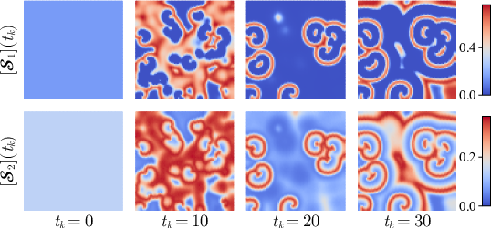
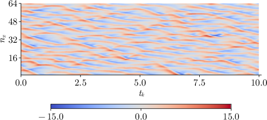

# Local Particle Flow Filters for State Estimation in Large-Scale Dynamic Systems

This repository provides implementations of **sequential Monte Carlo methods (particle filters) for large-scale stochastic dynamical systems**, with a particular focus on systems driven by **Brownian motion** and **continuous-time observation processes**.

The framework is designed for **high-dimensional state estimation problems** arising in applications such as reaction–diffusion systems and weather forecasting,

Although our examples focus on **spatially discretised PDE systems**, the algorithms are dimension-agnostic and can be applied to general nonlinear state-space models.


Despite their efficacy, particle filters face challenges in large-scale systems where the recursive nature leads to ensemble degeneracy. As iterations progress, the weights tend to concentrate on fewer particles, reducing diversity and leading to sample impoverishment.

## Our Approach

To address these challenges, we present a novel method that integrates *particle flow* and *local particle filters*:

- **Particle Flow**: We reposition predicted particles through a dynamic law of motion, mitigating sample impoverishment by diversifying particle positions without relying solely on resampling

- **Local Particle Filters**: We leverage the decay-of-correlations property inherent in large-scale systems. This involves sampling in lower-dimensional partitions of the state space, maintaining computational efficiency while reducing degeneracy

By combining particle flow and local particle filters, our approach:

- Reduces the need for resampling, preventing sample impoverishment
- Maintains computational efficiency through dimensionality partitioning
- Provides reliable state estimation across diverse applications

### Filtering methods

The variable `bpf_type` specifies which particle filter is used:

| `bpf_type` | Method |
|-----------|-------|
| `1` | Bootstrap particle filter with the standard importance distribution and systematic resampling (other resampling techniques available) |
| `2` | Block particle filter with the optimal importance distribution |
| `3` | Block particle filter with the standard importance distribution and particle flow (feedback particle filter) |
| `4` | Block particle filter with the optimal importance distribution and particle flow (feedback particle filter) |
| `5` | Block particle filter with the standard importance distribution and particle flow (exact flow filter) |

An ensemble Kalman filter (EnKF) is also available. Our implementation follows the SVD-based algorithm described in

Evensen, G. The Ensemble Kalman Filter: theoretical formulation and practical implementation. *Ocean Dynamics* **53**, 343–367 (2003). https://doi.org/10.1007/s10236-003-0036-9

# Associated Publications

This repository forms the computational backbone of the following publications.

Magalhães, J. A. F., Neto, O. B. L., & Corona, F.  
[*Block particle filters for state estimation of stochastic reaction-diffusion systems*](https://aaltodoc.aalto.fi/items/5dc5f917-1e83-4638-8dfe-5c4bf254196c).  
IFAC Conference Proceedings.

Magalhães, J. A. F., Neto, O. B. L., Harjunkoski, I., & Corona, F.  
*Local ensemble flow filters for large-scale dynamic systems*.  
Under review.

**For reproducibility, the true state trajectories and observations are available at https://doi.org/10.5281/zenodo.21032518.**

# Repository Structure

```
models/        Dynamical system models (e.g. Oregonator reaction–diffusion system, Lorenz 96, Gauss-Markov)

utils/
  simulation.jl    Simulation utilities
  blocking.jl      Block localisation utilities
  filtering.jl     Particle filtering algorithms

scripts/      Example scripts reproducing experiments
```

# Requirements

The code is written in **Julia**.

Required packages include:

- `LinearAlgebra`
- `SparseArrays`
- `Distributions`

Activate the environment before running the scripts:

```julia
import Pkg
Pkg.activate(".")
Pkg.instantiate()
```

---

# Example 1: Reaction-Diffusion systems

We estimate a reaction–diffusion system under the Oregonator dynamics.
Below are snapshots of a simulated trajectory of the time-discretised stochastic Oregonator dynamics at different time steps 𝑘. The axes represent the spatial coordinates.


```julia
# LIBRARIES ______________________________
using LinearAlgebra, JLD2, Dates

include("../utils/simulation.jl")
include("../utils/blocking.jl")
include("../models/Oregonator.jl")
include("../utils/filtering.jl")

# AUXILIARY FUNCTIONS
⊗(A,B) = kron(sparse(A), B)

Φᵤ(u) = exp.(-1/(2*15) .* (u.-10).^2)
Φᵥ(v) = exp.(-1/(2*15) .* (v.-40).^2)

# SIMULATION HORIZON
K = 3000
Δt = 0.01

# SPATIAL GRID
S = (80,80)
δx = 0.02

# STATE AND OUTPUT DIMENSIONS
Nx = 2*S[1]*S[2]
Ny = 10*S[1]*S[2]

# MODEL PARAMETERS
θx = [0.08, 0.95, 0.0075, 5e-4, 5e-6]

Σx = 1e-2 * √(Δt)
Σy = sqrt(1e-5)

# MODEL EQUATIONS
f(x) = Oregonator_RK4(x; θ=θx, Δt=Δt, ∇²=∇²_FDM(S, δx))
g(x) = x * Σx

# OUTPUT MATRIX
C = [Φᵤ.(0:5:50-1) ⊗ I(S[1]*S[2])  Φᵥ.(0:5:50-1) ⊗ I(S[1]*S[2])]

# INITIAL STATE
ϵ,α,q = θx[1:3]
x0 = ones(S[1]*S[2]*2) .* (1 - α - q + sqrt((α+q-1)^2 + 4q*(1+α))) / 2

# SIMULATION
_, x, y = simulate(f, g, C, Σy, x0, K, verbose=true)

# PARTICLE FILTERING
Np = 128

κx = BlockIndexing(Nx, S, (8,8))
κy = BlockIndexing(Ny, S, (8,8))

xe_1, _, _, _, _, t_1 = BlockPF(f, g, C, y, Σy, x0, Np, κx, κy, verbose=true, bpf_type=1)
xe_2, _, _, _, _, t_2 = BlockPF(f, g, C, y, Σy, x0, Np, κx, κy, verbose=true, bpf_type=2)
xe_3, _, _, _, _, t_3 = BlockPF(f, g, C, y, Σy, x0, Np, κx, κy, verbose=true, bpf_type=3)
xe_4, _, _, _, _, t_4 = BlockPF(f, g, C, y, Σy, x0, Np, κx, κy, verbose=true, bpf_type=4)
xe_5, _, _, t_5 = EnKF(f, g, C, y, Σy, x0, Np, verbose=true)

```

# Example 2: Lorenz 96
We estimate a 1024-dimensional Lorenz 96 system. Below is the Hovmöller diagram of a chaotic attractor (θ = 8) for the first 64 coordinates in a simulated trajectory. The initial condition is spatially autocorrelated (with correlation 0.9) and 𝑥 ∼ N(0, 0.01²). The state evolution is discretised with Δ𝑡 = 0.01. The first 100 steps are considered a burn-in period, and are discarded from this plot and subsequent filtering procedures.



```julia
# LIBRARIES ______________________________
using LinearAlgebra, JLD2, Dates, Distributions

include("../utils/simulation.jl");
include("../utils/blocking.jl");
include("../models/Lorenz96.jl");
include("../utils/filtering.jl");

# DEFINITIONS (EXPERIMENT) _____________________________________________________
const Ktotal = 1099;  # Simulation horizon with initial burn-in 
const Δt = 0.01;      # Simulation horizon / Discretisation interval

tvec = Δt:Δt:(Δt*(Ktotal-99))    # Actual time horizon for filtering

xx0 = 16;   # For the covariance matrix of initial condition
     
# DEFINITIONS (SYSTEM) _________________________________________________________
Nx = 2^10       # State dimension in univariate domain
S  = (Nx,1);    # Indexing each coordinate of the state variable with a distinct natural number.

## Dynamic parameters (θ)
const θx  = 8.0; # Chaotic regime 8.0   Periodic regime 2.75

## Noise parameters
Σx = 1e0 * √(Δt);     # Process noise standard deviation (already multiplied by Δt)
Σy = 1e0 ; 

## Model equations (state/output)
# State equation [ dx = f(x)dt + g(x)dW ], already in discrete-time
f(x::AbstractArray{Float64}) = lorenz96_RK4(x; θ=θx, Δt=Δt);
g(x::AbstractArray{Float64}) = Σx; # Standard Brownian motion

# Output equation,  y = Cx + v(x)
C  = sparse(zeros(Nx÷2, Nx)); [C[n, 2n-1] = 1.0 for n in 1:Nx÷2];
Ny = size(C, 1);

## AUXILIARY VARIABLES__________________________________________________________
# Initial state for simulation based on spatially autocorrelated variables
ρ = 0.9           # autocorrelation
σ² = 0.01         # desired variance
ϵ_dist = Normal(0, sqrt(σ² * (1 - ρ^2)))  # innovation variance for AR(1)

# Initialise and generate AR(1) process
x0 = zeros(Nx)
x0[1] = rand(Normal(θx, sqrt(σ²)))  # start from stationary distribution
for nx in 2:Nx
    x0[nx] = ρ * x0[nx-1] + rand(ϵ_dist)
end

# ________________________________________

# SCRIPT _________________________________
# -- Simulation --
_,xtotal,ytotal = simulate(f, g, C, Σy, x0, Ktotal, verbose=true);    # Simulates the system to generate data
K = Ktotal-99; 

x = xtotal[:, end-K+1:end]; y = ytotal[:, end-K+1:end]; # Removing  burn-in period
x0 .= x[:, 1]

# -- Filtering --
Np = 512;   # Number of particles

ssk = 2^8                       # Block size (per dimension)
Sb = (ssk, 1)
Nb = (S[1]÷Sb[1])*(S[2]÷Sb[2])  # Block count
κx = BlockIndexing(Nx, S, Sb)
κy = BlockIndexing(Ny, S, Sb)

xe_1, _, _, _, _, t_1 = BlockPF(f, g, C, y, Σy, x0, Np, κx, κy, verbose=true, bpf_type=1)
xe_2, _, _, _, _, t_2 = BlockPF(f, g, C, y, Σy, x0, Np, κx, κy, verbose=true, bpf_type=2)
xe_3, _, _, _, _, t_3 = BlockPF(f, g, C, y, Σy, x0, Np, κx, κy, verbose=true, bpf_type=3)
xe_4, _, _, _, _, t_4 = BlockPF(f, g, C, y, Σy, x0, Np, κx, κy, verbose=true, bpf_type=4)
xe_5, _, _, t_5 = EnKF(f, g, C, y, Σy, x0, Np, verbose=true)
```

### ITAE: median ± IQR (the lower the better)
<h3>Np=256</h3>
<table>
  <thead>
    <tr>
      <th rowspan="2" style="text-align:right;">bpf_type</th>
      <th colspan="9" style="text-align:center;">Block size $\overline{V}_b$</th>
    </tr>
    <tr>
      <th style="text-align:right;">4</th>
      <th style="text-align:right;">8</th>
      <th style="text-align:right;">16</th>
      <th style="text-align:right;">32</th>
      <th style="text-align:right;">64</th>
      <th style="text-align:right;">128</th>
      <th style="text-align:right;">254</th>
      <th style="text-align:right;">512</th>
      <th style="text-align:right;">1024</th>
    </tr>
  </thead>
  <tbody>
    <tr>
      <td style="text-align:right;">1 (locSIR-std)</td>
      <td style="text-align:right;">1158.16 ± 85.28</td>
      <td style="text-align:right;">1566.56 ± 131.65</td>
      <td style="text-align:right;">2844.93 ± 126.74</td>
      <td style="text-align:right;">4632.83 ± 176.01</td>
      <td style="text-align:right;">5851.93 ± 95.75</td>
      <td style="text-align:right;">6585.11 ± 63.77</td>
      <td style="text-align:right;">7119.14 ± 82.48</td>
      <td style="text-align:right;">7480.03 ± 55.04</td>
      <td style="text-align:right;">7699.99 ± 141.23</td>
    </tr>
    <tr>
      <td style="text-align:right;">2 (locSIR-opt)</td>
      <td style="text-align:right;">1140.07 ± 43.02</td>
      <td style="text-align:right;">1461.34 ± 88.53</td>
      <td style="text-align:right;">2517.03 ± 188.99</td>
      <td style="text-align:right;">4039.82 ± 100.9</td>
      <td style="text-align:right;">4975.45 ± 96.7</td>
      <td style="text-align:right;">5493.52 ± 54.8</td>
      <td style="text-align:right;">5816.29 ± 98.6</td>
      <td style="text-align:right;">6042.25 ± 69.11</td>
      <td style="text-align:right;">6172.8 ± 124.07</td>
    </tr>
    <tr>
      <td style="text-align:right;">3 (locFPF)</td>
      <td style="text-align:right;">844.06 ± 1.87</td>
      <td style="text-align:right;">795.57 ± 2.16</td>
      <td style="text-align:right;">776.94 ± 1.06</td>
      <td style="text-align:right;">774.89 ± 1.68</td>
      <td style="text-align:right;">792.18 ± 3.04</td>
      <td style="text-align:right;">838.19 ± 4.98</td>
      <td style="text-align:right;">983.11 ± 12.68</td>
      <td style="text-align:right;">1953.32 ± 119.69</td>
      <td style="text-align:right;">6085.37 ± 116.93</td>
    </tr>
  </tbody>
</table>

<h3>Np=512</h3>
<table>
  <thead>
    <tr>
      <th rowspan="2" style="text-align:right;">bpf_type</th>
      <th colspan="9" style="text-align:center;">Block size $\overline{V}_b$</th>
    </tr>
    <tr>
      <th style="text-align:right;">4</th>
      <th style="text-align:right;">8</th>
      <th style="text-align:right;">16</th>
      <th style="text-align:right;">32</th>
      <th style="text-align:right;">64</th>
      <th style="text-align:right;">128</th>
      <th style="text-align:right;">254</th>
      <th style="text-align:right;">512</th>
      <th style="text-align:right;">1024</th>
    </tr>
  </thead>
  <tbody>
    <tr>
      <td style="text-align:right;">1 (locSIR-std)</td>
      <td style="text-align:right;">1044.05 ± 44.06</td>
      <td style="text-align:right;">1250.87 ± 93.52</td>
      <td style="text-align:right;">2336.97 ± 174.8</td>
      <td style="text-align:right;">4230.12 ± 93.01</td>
      <td style="text-align:right;">5590.68 ± 98.71</td>
      <td style="text-align:right;">6422.66 ± 103.9</td>
      <td style="text-align:right;">7033.54 ± 50.57</td>
      <td style="text-align:right;">7418.85 ± 118.81</td>
      <td style="text-align:right;">7702.1 ± 61.96</td>
    </tr>
    <tr>
      <td style="text-align:right;">2 (locSIR-opt)</td>
      <td style="text-align:right;">1056.39 ± 32.46</td>
      <td style="text-align:right;">1236.79 ± 64.52</td>
      <td style="text-align:right;">2138.5 ± 148.51</td>
      <td style="text-align:right;">3701.22 ± 121.27</td>
      <td style="text-align:right;">4758.95 ± 76.94</td>
      <td style="text-align:right;">5383.52 ± 77.86</td>
      <td style="text-align:right;">5753.99 ± 71.56</td>
      <td style="text-align:right;">5931.14 ± 72.2</td>
      <td style="text-align:right;">6103.17 ± 102.48</td>
    </tr>
    <tr>
      <td style="text-align:right;">3 (locFPF)</td>
      <td style="text-align:right;">841.43 ± 1.45</td>
      <td style="text-align:right;">791.14 ± 2.15</td>
      <td style="text-align:right;">770.19 ± 0.96</td>
      <td style="text-align:right;">762.98 ± 1.64</td>
      <td style="text-align:right;">767.44 ± 2.55</td>
      <td style="text-align:right;">785.01 ± 4.11</td>
      <td style="text-align:right;">832.17 ± 4.2</td>
      <td style="text-align:right;">980.86 ± 9.67</td>
      <td style="text-align:right;">1962.77 ± 194.38</td>
    </tr>
  </tbody>
</table>

<h3>Np=1024</h3>
<table>
  <thead>
    <tr>
      <th rowspan="2" style="text-align:right;">bpf_type</th>
      <th colspan="9" style="text-align:center;">Block size $\overline{V}_b$</th>
    </tr>
    <tr>
      <th style="text-align:right;">4</th>
      <th style="text-align:right;">8</th>
      <th style="text-align:right;">16</th>
      <th style="text-align:right;">32</th>
      <th style="text-align:right;">64</th>
      <th style="text-align:right;">128</th>
      <th style="text-align:right;">254</th>
      <th style="text-align:right;">512</th>
      <th style="text-align:right;">1024</th>
    </tr>
  </thead>
  <tbody>
    <tr>
      <td style="text-align:right;">1 (locSIR-std)</td>
      <td style="text-align:right;">993.37 ± 31.8</td>
      <td style="text-align:right;">1082.56 ± 63.01</td>
      <td style="text-align:right;">1952.17 ± 61.08</td>
      <td style="text-align:right;">3763.34 ± 96.49</td>
      <td style="text-align:right;">5314.56 ± 60.92</td>
      <td style="text-align:right;">6298.26 ± 113.02</td>
      <td style="text-align:right;">6888.94 ± 119.6</td>
      <td style="text-align:right;">7370.27 ± 87.33</td>
      <td style="text-align:right;">7662.44 ± 54.24</td>
    </tr>
    <tr>
      <td style="text-align:right;">2 (locSIR-opt)</td>
      <td style="text-align:right;">994.23 ± 38.55</td>
      <td style="text-align:right;">1091.6 ± 85.48</td>
      <td style="text-align:right;">1778.81 ± 79.24</td>
      <td style="text-align:right;">3360.21 ± 85.48</td>
      <td style="text-align:right;">4606.53 ± 92.42</td>
      <td style="text-align:right;">5263.75 ± 68.59</td>
      <td style="text-align:right;">5683.23 ± 81.68</td>
      <td style="text-align:right;">5935.76 ± 61.65</td>
      <td style="text-align:right;">6111.45 ± 64.1</td>
    </tr>
    <tr>
      <td style="text-align:right;">3 (locFPF)</td>
      <td style="text-align:right;">840.08 ± 0.88</td>
      <td style="text-align:right;">789.45 ± 0.64</td>
      <td style="text-align:right;">767.03 ± 0.83</td>
      <td style="text-align:right;">757.68 ± 1.48</td>
      <td style="text-align:right;">756.52 ± 1.82</td>
      <td style="text-align:right;">763.82 ± 3.02</td>
      <td style="text-align:right;">782.49 ± 3.86</td>
      <td style="text-align:right;">832.37 ± 2.41</td>
      <td style="text-align:right;">978.15 ± 10.64</td>
    </tr>
  </tbody>
</table>